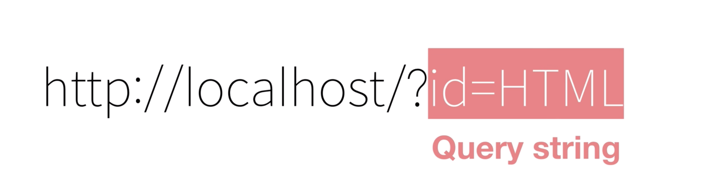

# NODE MEMO

## 1) query string

-  Query String: 서버에게 무엇이 필요한지, 혹은 클라이언트에게 무엇이 필요한지 묻는 문자열
  

<!--
### 결론  
웹브라우저가 하는 역할은 사용자가 요청한 정보를 웹서버에게 대신 물어봐 주는(요청헤더를 이용해서) 기능이다. 웹서버는 자기가 가지고 있는 정보를 보내주면서 응답헤더를 만들어주는 기계이다. 그러면 웹브라우저는 응답한 정보를 화면에 그려주는 역할이다.

### 정리  
  1) HTTP -> 클라이언트와 서버 사이에 통신을 해주는 프로토콜  
  2) Client -> 요청자  
  3) Web server -> 요청을 받고 응답해주는 곳  
  4) Web browser -> client와 Server의 통역사(?) 역할   

## 2) HTTP Request Message

**HTTP Request Message**  
-  Web Browser와 Web Server가 서로 주고받는 메시지에 대해서 자세히 알아보자  
  (Brower -> Server)
  

  
### 1. Request line

  * Web browser와 web server가 어떤 방식으로 통신할 것인지 설명  
     * Get : 우리가 데이터를  web Server로부터 가져올 때 쓰는 것(질문)
     * HTTP/1.1 : 현재 Web browser가 현재 사용하고 있는 버전이다. 그래서 이 버전을 통해서 적당한 방식으로 통신을 하는 것이다.
     * HOST : 우리가 요청하는 Web site에 Web server 주소  
     * PORT : 사진에는 없지만 HOST/8080 적혀있는 경우가 있다. 쉽게 생각하면 HOST는 "재호네 집"이고 POST는 "재호방"이라고 보면 된다.
     * USER-AGENT : 요청하는 Web browser가 어떤 Web browser인지 나타낸다.
     * Accept Encoding : 데이터 양이 많을 때 압축하는 방식
     * If-Modified-Since : 내가 가지고 있는 파일에 대한 수정날짜

## 3) HTTP Response Message
-   Web Server와 Web Browser가 서로 주고받는 메시지에 대해서 자세히 알아보자  
  (Server -> Brower)   
  

* STATUS LINE
  * version(HTTP version)
  * status(상태) : 서버가 응답했을 때 상태 (ex 2XX,3XX,404..)
  * phrase :사람이 이해하기 쉽도록 풀어쓴 부분 (ex OK,ERROR ..)
  
* HEADER
   * Content-type : Web server가 응답할때 타입(이파일은 text이며 html로 해석한다. 이미지파일 이면 image/jpeg 이다.)
   * Contnet-Length : Size를 보여준다.(단위 byte)
   * Content Encoding : 압축방식

-->